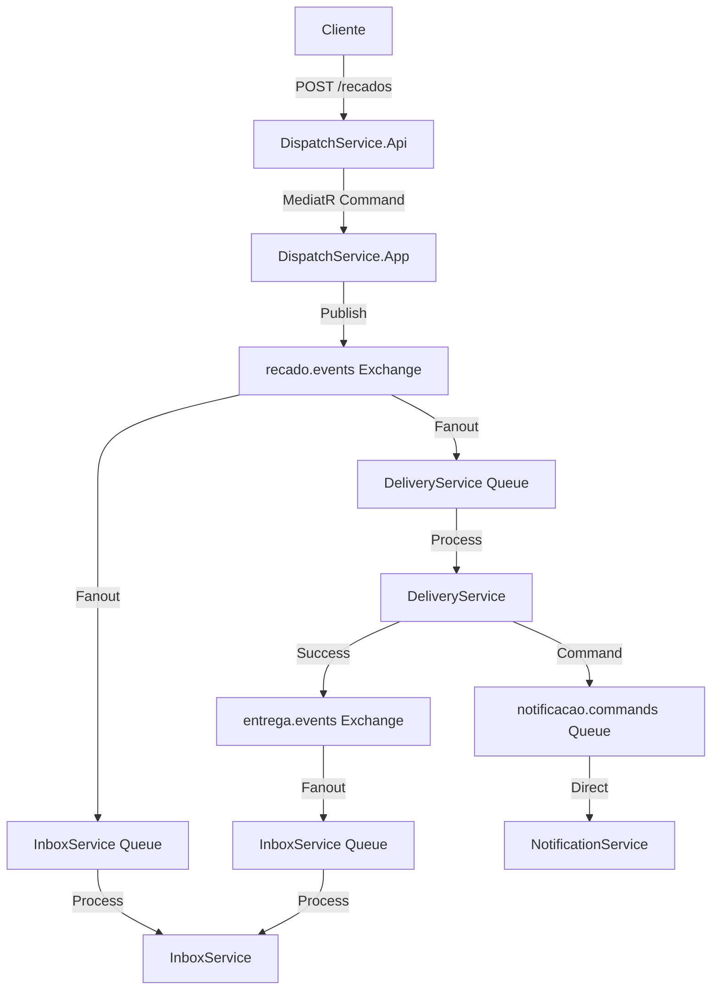

# Guilda dos Mensageiros - Arquitetura de Microsserviços

## 📋 Visão Geral

Este projeto implementa um sistema de mensageria distribuída usando **microsserviços** com **.NET 9**, demonstrando padrões arquiteturais modernos e boas práticas para sistemas distribuídos. O domínio simula uma "Guilda de Mensageiros" que entrega recados, mas o foco principal é a **arquitetura, padrões de projeto e mensageria assíncrona**.

## 🏗️ Arquitetura Geral

### Padrões Arquiteturais Aplicados

#### 🔵 **Arquitetura Hexagonal (Ports & Adapters)**
Cada microsserviço segue a **Arquitetura Hexagonal**, garantindo:
- **Isolamento do domínio** das preocupações de infraestrutura
- **Testabilidade** através de interfaces bem definidas
- **Flexibilidade** para trocar implementações sem afetar a lógica de negócio

#### 🔵 **CQRS (Command Query Responsibility Segregation)**
- **Commands**: Operações de escrita usando MediatR
- **Queries**: Operações de leitura otimizadas
- **Separação clara** entre leitura e escrita, especialmente nos serviços Dispatch e Inbox

#### 🔵 **Event-Driven Architecture**
- **Comunicação assíncrona** entre microsserviços via eventos
- **Desacoplamento temporal** - serviços podem processar eventos independentemente
- **Resiliência** através de filas e retry policies

#### 🔵 **Domain-Driven Design (DDD)**
- **Bounded Contexts** bem definidos por microsserviço
- **Aggregates** e **Value Objects** no layer Domain
- **Domain Events** para comunicação interna

## 🎯 Microsserviços

### 🌐 **DispatchService** (API Gateway)
**Responsabilidade**: Ponto de entrada HTTP para criação de recados

```
DispatchService/
├── DispatchService.Host.Api/          # 🌐 Web API + Swagger
├── DispatchService.Application/       # 📋 Commands/Queries (MediatR)
├── DispatchService.Domain/           # 🏛️ Entidades e Regras de Negócio
├── DispatchService.Infrastructure/   # 🗄️ EF Core + Postgres + Outbox
└── DispatchService.Integration/      # 📡 MassTransit + RabbitMQ
    ├── Topology/                     # 🏗️ Definições de Exchanges/Queues
    ├── EventsOut/                    # 📤 Publishers de Eventos
    ├── CommandsOut/                  # 📤 Publishers de Comandos
    └── Mappings/                     # 🔄 Domain ↔ Contracts
```

**Padrões Aplicados**:
- **API Gateway Pattern**: Ponto único de entrada
- **Outbox Pattern**: Consistência entre persistência e publicação de eventos
- **Command Pattern**: Operações encapsuladas via MediatR

---

### 🚚 **DeliveryService** (Worker)
**Responsabilidade**: Processa entregas e simula tentativas de entrega

```
DeliveryService/
├── DeliveryService.Host.Worker/      # ⚙️ Background Service
├── DeliveryService.Application/      # 📋 Handlers de Eventos
├── DeliveryService.Domain/          # 🏛️ Lógica de Entrega
├── DeliveryService.Infrastructure/  # 🗄️ Persistência de Estado
└── DeliveryService.Integration/     # 📡 Consumers + Publishers
    ├── EventsIn/                    # 📥 Consome RecadoCriadoEvent
    ├── EventsOut/                   # 📤 Publica EntregaConcluidaEvent/FalhouEvent
    └── CommandsOut/                 # 📤 Envia EnviarNotificacaoCommand
```

**Padrões Aplicados**:
- **Saga Pattern**: Coordenação de processo de entrega
- **Retry Pattern**: Tentativas com backoff exponencial
- **Circuit Breaker**: Proteção contra falhas em cascata

---

### 📥 **InboxService** (Worker)
**Responsabilidade**: Mantém timeline/histórico do destinatário

```
InboxService/
├── InboxService.Host.Worker/        # ⚙️ Background Service  
├── InboxService.Application/        # 📋 CQRS Handlers
├── InboxService.Domain/            # 🏛️ Timeline/Inbox Domain
├── InboxService.Infrastructure/    # 🗄️ Read/Write Models
└── InboxService.Integration/       # 📡 Event Consumers
    ├── EventsIn/                   # 📥 Todos os eventos do sistema
    ├── CommandsIn/                 # 📥 RegistrarNaInboxCommand
    └── Mappings/                   # 🔄 Event ↔ Timeline Entry
```

**Padrões Aplicados**:
- **CQRS**: Separação clara entre escrita (eventos) e leitura (timeline)
- **Event Sourcing**: Timeline construída a partir de eventos
- **Materialized View**: Timeline otimizada para consultas

---

### 🔔 **NotificationService** (Worker)
**Responsabilidade**: Envia notificações para remetentes e destinatários

```
NotificationService/
├── NotificationService.Host.Worker/     # ⚙️ Background Service
├── NotificationService.Application/     # 📋 Notification Handlers  
├── NotificationService.Domain/         # 🏛️ Notification Logic
├── NotificationService.Infrastructure/ # 🗄️ Providers (Email, SMS, etc)
└── NotificationService.Integration/    # 📡 Command Consumers
    ├── CommandsIn/                     # 📥 EnviarNotificacaoCommand
    └── Mappings/                       # 🔄 Command ↔ Notification
```

**Padrões Aplicados**:
- **Strategy Pattern**: Diferentes tipos de notificação (Email, SMS, Push)
- **Template Method**: Estrutura comum para envio de notificações
- **Adapter Pattern**: Integração com provedores externos

## 📦 Projeto Contracts

```
Contracts/
├── Events/                          # 📡 Eventos de Integração
│   ├── RecadoCriadoEvent.cs
│   ├── EntregaConcluidaEvent.cs
│   └── EntregaFalhouEvent.cs
└── Commands/                        # 📋 Comandos de Integração
    ├── EnviarNotificacaoCommand.cs
    └── RegistrarNaInboxCommand.cs
```

**Princípios Aplicados**:
- **Shared Kernel**: DTOs compartilhados entre bounded contexts
- **Backward Compatibility**: Versionamento cuidadoso dos contratos
- **Schema Evolution**: Preparado para evolução sem quebrar integrações

## 🔄 Fluxo de Mensageria

### Topologia RabbitMQ



### Padrões de Mensageria

#### 🔀 **Publish-Subscribe (Events)**
- **Exchanges Fanout**: `recado.events`, `entrega.events`
- **Múltiplos Consumers**: Cada serviço interessado recebe uma cópia
- **Desacoplamento**: Publishers não conhecem subscribers

#### 📬 **Point-to-Point (Commands)**  
- **Queues Direct**: `notificacao.commands`, `inbox.commands`
- **Single Consumer**: Apenas o serviço alvo processa
- **Garantia de Entrega**: Cada comando é processado exatamente uma vez

#### 🔄 **Reliability Patterns**
- **Dead Letter Queues (DLQ)**: `*.dlq` para mensagens falhadas
- **Retry com Backoff**: Tentativas exponenciais
- **Idempotência**: Handlers seguros para reprocessamento

## 🛠️ Stack Técnica

### Core Framework
- **.NET 9**: Host genérico + WebAPI
- **C# 13**: Records, Pattern Matching, Global Usings

### Mensageria
- **RabbitMQ**: Message Broker
- **MassTransit**: Abstração para mensageria + Patterns

### Persistência  
- **PostgreSQL**: Banco principal
- **Entity Framework Core 9**: ORM + Migrations
- **Dapper**: Queries otimizadas (quando necessário)

### Observabilidade
- **Serilog**: Logging estruturado
- **OpenTelemetry**: Distributed Tracing (futuro)

### Orquestração
- **Docker Compose**: Infraestrutura local
- **Background Services**: Workers .NET

## 🧪 Testes e Qualidade

### Estrutura de Testes (Planejada)
```
Tests/
├── Unit/                           # 🔬 Testes Unitários
│   ├── Domain/                     # Regras de negócio
│   └── Application/                # Handlers MediatR
├── Integration/                    # 🔗 Testes de Integração  
│   ├── API/                        # Endpoints
│   └── Messaging/                  # Publishers/Consumers
└── E2E/                           # 🎭 Testes End-to-End
    └── Scenarios/                  # Fluxos completos
```

### Padrões de Teste
- **AAA Pattern**: Arrange, Act, Assert
- **Test Doubles**: Mocks, Stubs, Fakes
- **Integration Testing**: TestContainers para deps externas
- **Contract Testing**: Pact para APIs

## 🚀 Como Executar

### Pré-requisitos
- .NET 9 SDK
- Docker Desktop
- PowerShell (para scripts)

### Passos

1. **Clone o repositório**
```bash
git clone https://github.com/rafael-ventura/guilda-mensageria-microservices.git
cd guilda-mensageria-microservices
```

2. **Teste todos os builds**
```powershell
.\test-all-builds.ps1
```

3. **Subir infraestrutura** (próximo passo)
```bash
docker-compose up -d
```

4. **Executar serviços** (próximo passo)
```bash
# DispatchService (API)
cd DispatchService/DispatchService.Host.Api
dotnet run

# Workers (em terminais separados)
cd DeliveryService/DeliveryService.Host.Worker
dotnet run

cd InboxService/InboxService.Host.Worker  
dotnet run

cd NotificationService/NotificationService.Host.Worker
dotnet run
```

## 📚 Próximos Passos

### Iteração 2: Infraestrutura
- [ ] Docker Compose (RabbitMQ + PostgreSQL)
- [ ] Bootstrap MassTransit + MediatR
- [ ] Configuração de topologia de mensageria
- [ ] Políticas de retry/DLQ

### Iteração 3: Domínio
- [ ] Implementação das regras de negócio
- [ ] Handlers de Commands/Events
- [ ] Persistência com EF Core
- [ ] Outbox Pattern

### Iteração 4: Observabilidade
- [ ] OpenTelemetry + Jaeger
- [ ] Health Checks
- [ ] Métricas customizadas
- [ ] Dashboard Grafana

## 🎯 Objetivos de Aprendizado

Este projeto demonstra:

✅ **Arquitetura de Microsserviços** com separação clara de responsabilidades
✅ **Event-Driven Architecture** com mensageria assíncrona
✅ **Domain-Driven Design** com bounded contexts bem definidos  
✅ **CQRS** para separação de leitura e escrita
✅ **Hexagonal Architecture** para testabilidade e flexibilidade
✅ **Reliability Patterns** para sistemas distribuídos resilientes
✅ **Modern .NET** com as melhores práticas da plataforma

---

**🎉 Estrutura básica completa! Todos os microsserviços buildando e prontos para a próxima iteração!**
