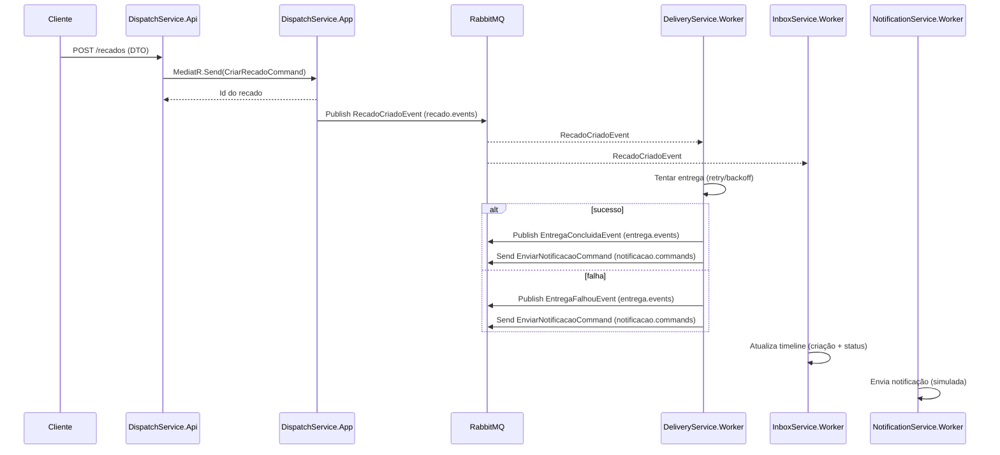

# 📋 Briefing do Projeto — Guilda dos Mensageiros
## Microsserviços + Mensageria com .NET 9

---

## 🎯 **Contexto & Objetivo**

Projeto didático e realista para treinar **microsserviços com mensageria** usando .NET. 

- **Domínio:** Lúdico (entregas de "recados" por uma guilda)
- **Foco:** Arquitetura, padrões de projeto e boas práticas
- **Objetivo:** Sistema distribuído resiliente e bem estruturado

---

## 🛠️ **Stack Técnica (Fixa)**

### **Core Framework**
- ✅ **.NET 9** - Host genérico (Workers) + WebAPI (Gateway)
- ✅ **C# 13** - Records, Pattern Matching, Global Usings

### **Mensageria**
- ✅ **RabbitMQ** - Message Broker
- ✅ **MassTransit** - Abstração + Patterns (Saga, Outbox, Retry)

### **Persistência**
- ✅ **SQL Server** - Banco principal (mudou de PostgreSQL)
- ✅ **EF Core 9** - ORM + Migrations + Configurations
- ✅ **Dapper** - Queries otimizadas (quando necessário)

### **Padrões Internos**
- ✅ **MediatR** - Commands/Queries/Notifications locais
- ✅ **Repository + Unit of Work** - Abstração de dados
- ✅ **Outbox Pattern** - Consistência transacional

### **Observabilidade**
- ✅ **Serilog** - Logging estruturado
- 🔄 **OpenTelemetry** - Telemetria distribuída (futuro)

### **Infraestrutura**
- ✅ **Docker Compose** - RabbitMQ + SQL Server local
- ✅ **Contracts** - Projeto separado para DTOs de integração

> ⚠️ **Regra:** Não inventar libs novas sem justificar. Se sugerir algo fora da lista, explicar por quê, impacto e como remover.

---

## 🏗️ **Arquitetura (Hexagonal / Ports & Adapters)**

### **🎯 Microsserviços**

#### **🌐 DispatchService** *(único com API HTTP)*
- **Responsabilidade:** Ponto de entrada REST
- **Função:** Recebe requisições, processa commands (MediatR), persiste e publica eventos
- **Padrões:** API Gateway + Outbox Pattern + CQRS

#### **🚚 DeliveryService** *(Worker)*
- **Responsabilidade:** Processa entregas
- **Função:** Consome eventos de criação, simula entrega, publica status
- **Padrões:** Saga Pattern + Retry + Circuit Breaker

#### **📥 InboxService** *(Worker)*
- **Responsabilidade:** Timeline do destinatário
- **Função:** Mantém histórico, consome eventos e comandos de integração
- **Padrões:** CQRS + Event Sourcing + Materialized View

#### **🔔 NotificationService** *(Worker)*
- **Responsabilidade:** Notificações
- **Função:** Consome comandos, notifica remetente/destinatário (simulado)
- **Padrões:** Strategy + Template Method + Adapter

---

## 📂 **Estrutura de Pastas por Serviço**

```
<Service>/
  <Service>.Host.Api       # 🌐 só DispatchService
  <Service>.Host.Worker    # ⚙️ Delivery/Inbox/Notification
  <Service>.Application    # 📋 Commands/Queries/Handlers (MediatR)
  <Service>.Domain         # 🏛️ Entities/VOs/Domain Events
  <Service>.Infrastructure # 🗄️ DB, Outbox, Bus config, Providers
  <Service>.Integration    # 📡 MENSAGERIA (adapters)
    ├── Topology/          # 🏗️ Exchanges/Queues, convenções
    ├── EventsIn/          # 📥 Consumers de eventos externos
    ├── EventsOut/         # 📤 Publishers de eventos externos
    ├── CommandsIn/        # 📥 Consumers de comandos de integração
    ├── CommandsOut/       # 📤 Publishers de comandos de integração
    └── Mappings/          # 🔄 Domain ↔ Contracts (DTOs)
```

### **📦 Projeto Compartilhado**
```
Contracts/
  ├── Events/              # 📡 RecadoCriadoEvent, EntregaConcluidaEvent, etc.
  └── Commands/            # 📋 EnviarNotificacaoCommand, RegistrarNaInboxCommand
```

> ⚠️ **Regra:** Apenas DTOs de integração. **NÃO** colocar entidades de domínio.

---

## 🔄 **Topologia de Mensageria (Nomes Canônicos)**

### **📡 Exchanges (Fanout)**
```
recado.events    → publica: DispatchService
                 → consomem: DeliveryService, InboxService

entrega.events   → publica: DeliveryService  
                 → consome: InboxService (+ Notification opcional)
```

### **📬 Queues (Direct/Commands)**
```
notificacao.commands → publica: DeliveryService
                     → consome: NotificationService

inbox.commands       → publica: Dispatch/Delivery (quando preferir comando)
                     → consome: InboxService
```

### **💀 Dead Letter Queues**
```
*.dlq → sufixo para cada fila com política de retry
```

### **🔄 Regras de Mensageria**
- **Eventos:** Broadcast (fanout) - múltiplos consumers
- **Comandos:** Point-to-point (direct) - single consumer
- **Idempotência:** Handlers seguros para reprocessamento
- **Retry:** Backoff exponencial com DLQ

---

## 🌊 **Fluxo Ponta-a-Ponta**



---

## ⚙️ **Configurações & Convenções**

### **🏷️ Naming**
- **Exchanges:** `recado.events`, `entrega.events`
- **Queues:** `notificacao.commands`, `inbox.commands`
- **DLQ:** `*.dlq`

### **📝 Versionamento**
- **Namespace/Sufixo:** `v1`, `v2` para evitar breaking changes
- **Evolução:** `EntregaConcluidaEventV2` quando quebrar compatibilidade

### **🔧 Configuração por Serviço**
```json
{
  "RabbitMQ": {
    "Host": "localhost",
    "VirtualHost": "guilda", 
    "Username": "admin",
    "Password": "admin123",
    "PrefetchCount": 10,
    "RetryIntervals": [1, 5, 15, 30, 60]
  },
  "ConnectionStrings": {
    "DefaultConnection": "Server=localhost,1433;Database=Guilda{Service}..."
  }
}
```

---

## 🎯 **Progresso de Implementação**

### ✅ **Iteração 1 - Estrutura Base (CONCLUÍDA)**
- ✅ Solução e projetos com estrutura hexagonal
- ✅ Docker Compose (RabbitMQ + SQL Server)
- ✅ Bootstrap MassTransit + MediatR em todos os serviços
- ✅ Contracts v1 implementados
- ✅ Topologia declarada e registrada no bus
- ✅ Consumers básicos registrados
- ✅ Políticas de retry/DLQ configuráveis

### ✅ **DispatchService (COMPLETO)**
- ✅ Domain Layer (Recado, OutboxMessage, Repositories)
- ✅ Infrastructure Layer (EF Core, SQL Server, Unit of Work)
- ✅ Application Layer (Commands, Handlers, Outbox Pattern)
- ✅ API Layer (Controller, Swagger, Validações)
- ✅ Migrações EF Core criadas

### 🔄 **Próximas Iterações**
- 🔄 **DeliveryService** - Domain + Consumers + Publishers
- 🔄 **InboxService** - CQRS + Timeline + Event Sourcing
- 🔄 **NotificationService** - Providers + Strategy Pattern
- 🔄 **Testes de Integração** - Fluxo end-to-end
- 🔄 **Observabilidade** - OpenTelemetry + Métricas

---

## 🧪 **Critérios de Aceite**

### **✅ Iteração 1 (CONCLUÍDA)**
- ✅ Todos os serviços sobem e conectam ao RabbitMQ
- ✅ Exchanges/filas criadas automaticamente
- ✅ Logs mostram conexões e bindings
- ✅ Consumers registrados sem exceções
- ✅ DispatchService aceita POST /api/recados

### **🎯 Próximas Iterações**
- 🔄 Fluxo completo: POST → Event → Processing → Notification
- 🔄 Outbox Pattern funcionando (consistência)
- 🔄 Retry policies com DLQ
- 🔄 Timeline do destinatário atualizada
- 🔄 Notificações enviadas

---

## 📋 **Comandos Úteis**

### **🐳 Docker**
```bash
docker-compose up -d                    # Subir infraestrutura
docker-compose logs -f rabbitmq         # Logs RabbitMQ
docker-compose logs -f sqlserver        # Logs SQL Server
```

### **🗄️ Migrations**
```bash
dotnet ef migrations add <Nome> --project Infrastructure --startup-project Host.Api
dotnet ef database update --project Infrastructure --startup-project Host.Api
```

### **🚀 Executar Serviços**
```bash
# DispatchService (API)
cd DispatchService/DispatchService.Host.Api && dotnet run

# Workers (terminais separados)
cd DeliveryService/DeliveryService.Host.Worker && dotnet run
cd InboxService/InboxService.Host.Worker && dotnet run
cd NotificationService/NotificationService.Host.Worker && dotnet run
```

### **🔍 URLs Importantes**
- **DispatchService API:** `https://localhost:7000`
- **Swagger:** `https://localhost:7000/swagger`
- **RabbitMQ Management:** `http://localhost:15672` (admin/admin123)

---

## 🎉 **Status Atual**

**✅ ESTRUTURA BÁSICA COMPLETA!**  
**✅ DISPATCHSERVICE 100% FUNCIONAL!**  
**🔄 PRÓXIMO: DELIVERYSERVICE**

Todos os microsserviços buildando e prontos para desenvolvimento individual! 🚀